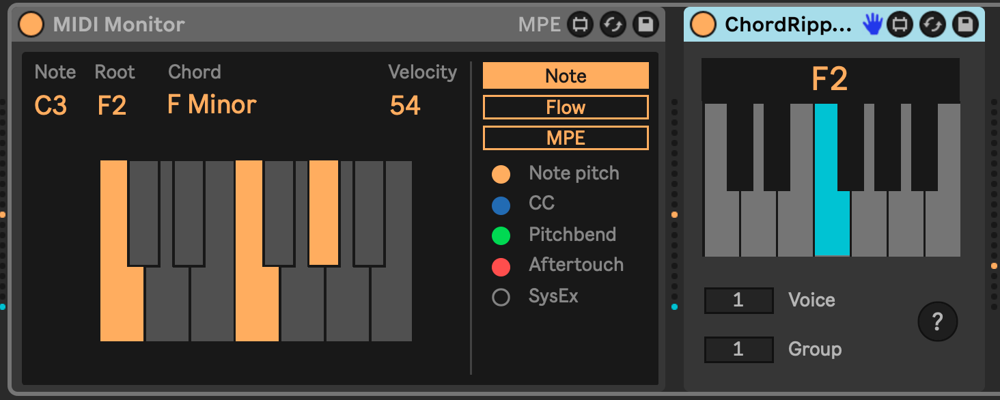
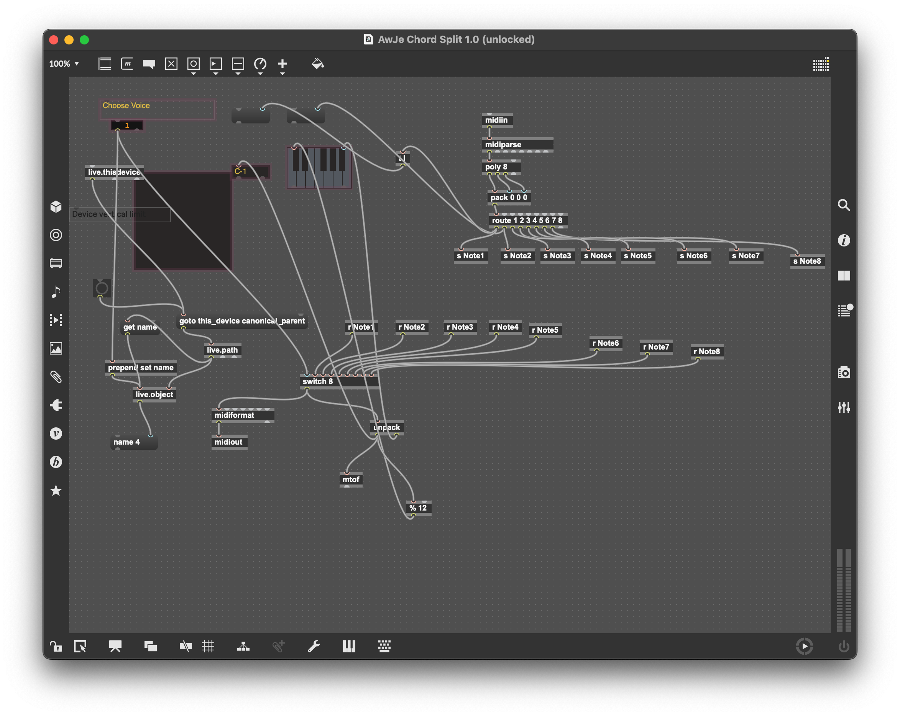
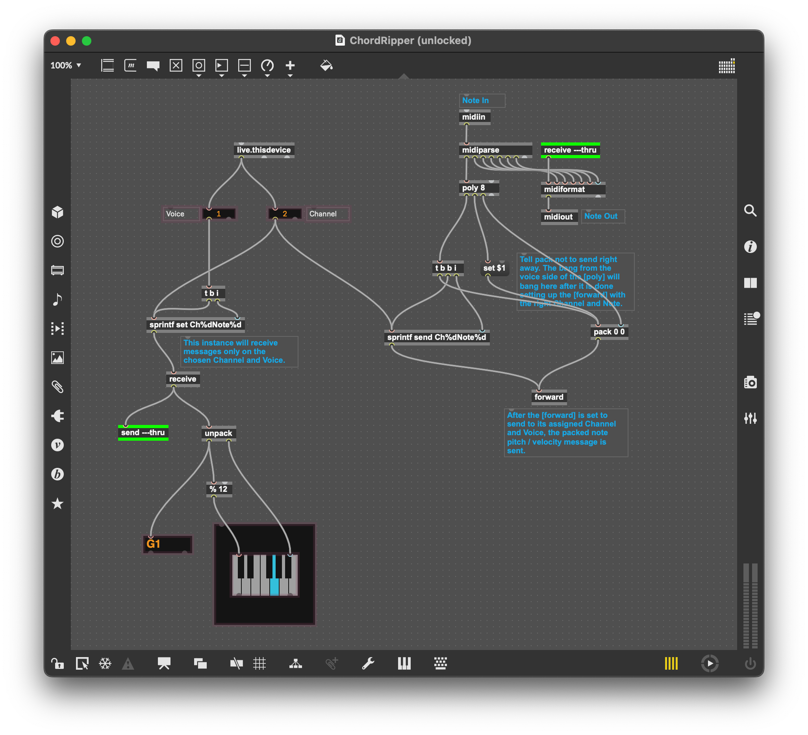

# m4l-ChordRipper
## Decompose chords across tracks.

This is a Max For Live MIDI effect that allows you to decompose a chord and use its component notes in different tracks, creating chord-area-networks inside of your Live set.

### Changelog

Direct download links below.
* [DOWNLOAD v1](https://github.com/zsteinkamp/m4l-ChordRipper/raw/main/frozen/ChordRipper-v1.amxd) - 2023-09-09 - Initial release.

## Installation / Setup

If you just want to download and install the device, then go to the [frozen/](https://github.com/zsteinkamp/m4l-ChordRipper/tree/main/frozen) directory and download the newest .zip file there. You can also download it directly via the links in [*Changelog*](#changelog).

## Usage

Add an instance of `ChordRipper` to each track where you want to dissect a chord. Set the `Voice` parameter to the note number in the chord you want to receive. The notes are ordered by when they are received, so the first note played in the chord will be Voice 1, etc.

Use the `Channel` parameter to create different chord groups, a lot like selecting different walkie-talking channels. This allows you to have several independent chord groups in your Live set.

Any of the instances of `ChordRipper` can receive MIDI notes/chords. No matter which one receives the MIDI chord, it will broadcast the component notes for the other instances to receive, depending on their Voice / Channel configuration.

## Thanks
Thanks so much to [Awkward
Jesus](https://maxforlive.com/profile/user/AwkwardJesus) for initially creating
[AwJe ChordSplit](https://maxforlive.com/library/device.php?id=6429#22317).
That was my starting point for this device, but it is nearly completely
different under the hood now. The original device satisfied my original need
perfectly, but eventually I wanted to add the ability to have multiple chord
groups in one Live set.

That took me down my usual path of simplification.

By using a `[forward]` device (which is a lot like a `[send]` but it can change its destination), I was able to eliminate 8 pairs of send/receive devices and two routers from the original device, while adding the `Channel` functionality.

Original AwJe Chordsplit:

Chord Ripper:

## Common Problems

#### ...
...

## TODOs
* ...

